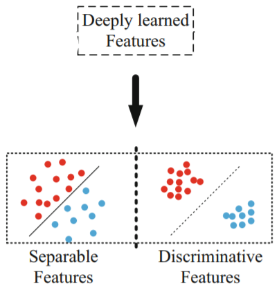
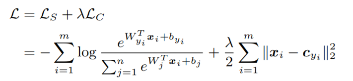

### About the Project
Given 30000 food images from 59 classes I have performed image classification task. Due to confidentiality I am unable to upload data here.
The goal of the project is improve the performance by introducing the strategy to capture high intra-class variance and low inter-class variance. 
There are a lot of algorithms that can be utilised such as :
* Center Loss (*A Discriminative Feature Learning Approach for Deep Face Recognition* - https://ydwen.github.io/papers/WenECCV16.pdf), 
* Large-margin Gaussian Mixture Loss (*Rethinking Feature Distribution for Loss Functions in Image Classification* - http://openaccess.thecvf.com/content_cvpr_2018/papers/Wan_Rethinking_Feature_Distribution_CVPR_2018_paper.pdf),etc.
   

### Center Loss
As given food data have low-inter class and high intra-class variance, besides Softmax loss function there is a need to enhance the discriminative power of the deeply learned features. Center Loss learns a center for deep features of each class and penalizes the distances between the deep features and their corresponding class centers. Deeply learned features are required to be discriminative and generalized enough for identifying new unseen data.

  

The proposed Center Loss function minimizing the intra-class variations while keeping the features of different classes separable and the function looks as below:

  

Cyi - yi class center of deep features. The centers are updated based on each mini-batch, in each iteration the centers are computed by averaging the features of the corresponding classes. In addition, to avoid large shifts caused by misclassified classes, the alpha scalar is used to control the learning rate of the centers. 
Both loss functions are combined to make the model more robust and generalize better for unseen data.

  

